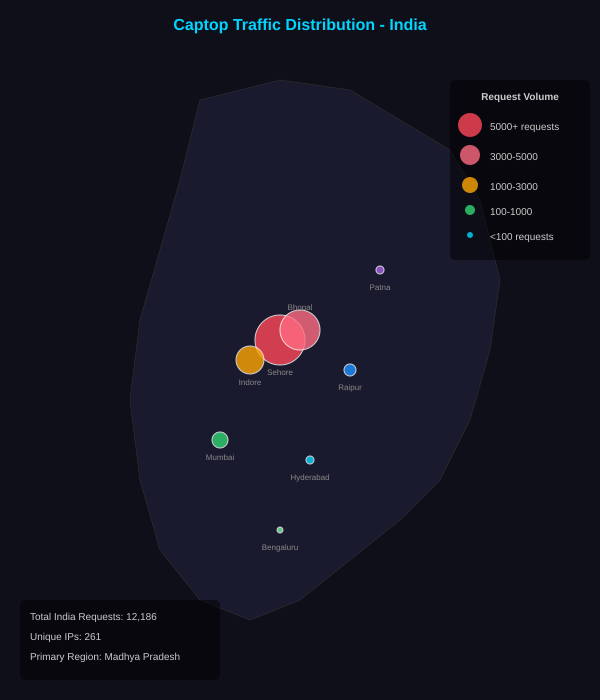

  
  <h1>captop / VTOP AutoCaptcha</h1>

**Captop** is a complete, open-source pipeline for researchers and ML enthusiasts to understand how to collect, label, and train models on real-world captcha data.

Since this project is practically complete (capturing captchas, acquiring labels via crowdsourcing, training the model, deploying the API via Docker on a DigitalOcean Droplet with GitHub Actions auto-deployment, and publishing the extension to the Firefox Add-ons store), I will be archiving it. If you're exploring this in the future, you can use it as a reference for getting started with curating datasets (the hardest part of ML) and deploying models (the easy part!).

I will continue working with these captchas outside of this repository, as I plan to create an open-source Android application for VTOP (you can do a lot with hidden WebViews in Android, and AI!).

## Browser Extension

  

The model is distributed as a browser extension to auto-solve captchas directly on the VTOP login page.

**[➡️ View Extension Installation Guide](extension/README.md)**

## The Story

This project started as a personal journey to learn Machine Learning. I wanted to work on something "unexplored" and real.

1. **The Hunt**: I used some **JS-hackery** to scrape and collect a raw dataset of captchas directly from my college's website.
2. **The Crowdsource**: Since the data was unlabeled, first I tried to get labels using the `Qwen3-VL 4B` model running on my old laptop, but that was not accurate (also slow, like 20 images in about 8 hrs, and those were wrong smh!!). Then, I built a lightweight, full-stack application (using Gemini 3.1 Pro) to crowdsource the labels. This allowed friends and contributors to help build the ground truth dataset.
3. **The Result**: After collecting over 800 labels and training a high-performance **CRNN (CNN+GRU)** model, I've reached the goal. The model now decodes these captchas with near 100% accuracy (actually 99.89%).

Now that the mission is complete, I've made the entire stack—from the scraping logic to the final trained model—**fully open-source**.

---

## Project Structure

- **extension/**: The browser extension for auto-solving captchas on VTOP.
- **api/**: The Rust-based high-performance backend API for inferencing ONNX models in production.
- **data/**: Labeled datasets (`captchas/`, `test/`) and the final trained weights (`models/`).
- **scripts/**: The core logic for training, decoding, exporting, and data utility.
- **crowdsource/**: The Flask-based crowdsourcing platform used initially to collect labels.
- **worker/**: Cloudflare Worker proxy configuration.

## Dataset

Access the labeled data for your own projects:
- `data/captchas`: The full labeled dataset (995 images).
- `data/test`: Some labeled test images on which the model produced malformed outputs.

## Performance & Usage

The model achieves a **Validation Loss: 0.0038**. 
- See **[data/models/README.md](data/models/README.md)** for loss charts and benchmarks.
- See **[MODEL_USAGE.md](MODEL_USAGE.md)** for pseudo-code on how to integrate the model into your own scripts.

## Analytics

Cool insights from the crowdsourcing phase:
- **[View Analytics Report](crowdsource/log_analysis.md)** — Contributor stats, traffic maps, and system performance.

  

## Contributors

A huge thanks to all the amazing people who helped crowdsource the data labels. This project wouldn't have been possible without you!

- [Aayush Chanda](https://github.com/Aayush-Chanda)
- [Abhishek](https://github.com/Ab705h)
- Aman
- Amritanshu Sahu
- [anand kr yadav](https://github.com/anand9608)
- Ansh
- [Arya](https://github.com/aryag-31)
- Aryan Agrahari
- [Blactract](https://github.com/CAPTAIN-BLACTRACT)
- Brijesh
- [Davood](https://github.com/TheDavood-10)
- [ffcs-planner-vitb.vercel.app](https://ffcs-planner-vitb.vercel.app/)
- Hardik
- Harshit
- [Kanishk](https://github.com/kanishk300)
- [Manov](https://github.com/Manov)
- Mayank
- Parth Sararthi
- Prateek
- [Pratyush](https://github.com/Pratyush-10)
- Puss in Boots
- [Raunak](https://github.com/Raunak-24)
- [Rishabh Bansal](https://github.com/Rishabh-Bansal)
- S
- [Sairam S](https://github.com/Sairam-S)
- [Sarthak](https://github.com/sarthak-01)
- Shaurya
- [Shivam](https://github.com/shivam-01)
- [Shreyas](https://github.com/shreyas-01)
- [Shubham](https://github.com/shubham-01)
- [Siddhant](https://github.com/siddhant-01)
- [Subal](https://github.com/ajsubal555)
- Sumit
- Sunidhi Suman
- [Suraj](https://github.com/suraj-01)
- [Tertiary Ion](https://github.com/TertiaryCo)
- urn.ab
- VANSHIKA
- [Vidishaa](https://github.com/vidishaa27)
- Vijay Naveen Mishra
- [Virat Nigam](https://github.com/viratnigam18)
- [Yash Priyam](https://github.com/Raunak-24)

# AI Disclosure

This project was developed with significant assistance from AI agents. The following models were used:

- **Gemini 3.1 Pro**
- **Claude Opus 4.6**