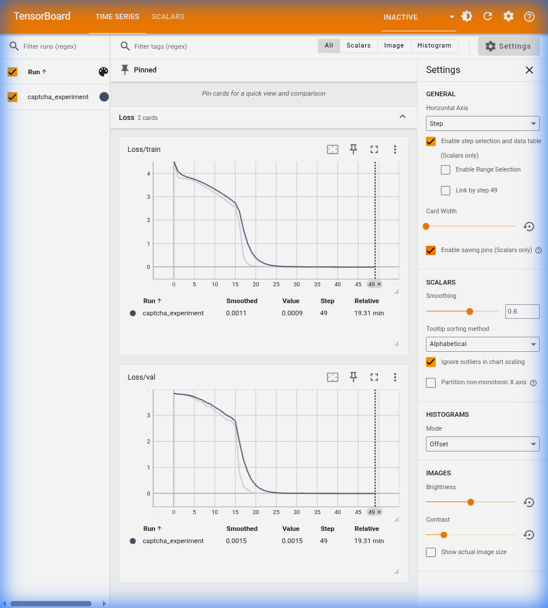

# Captcha Decoding Model

This directory contains the trained CRNN (CNN + GRU) model for decoding alphanumeric captchas.

## Training Performance

The model was trained for 50 epochs with CTC Loss. The following chart shows the training and validation loss convergence:

 

### Key Metrics:

- **Validation Loss**: 0.0038
- **Accuracy**: 99.89% on the validation split.

## Files

- `captcha_model.pth`: Original float32 PyTorch model (~23MB).
- `tensorboard_charts.png`: Visualization of the loss curves.

> **Note**: The ONNX exported model used by the Rust server is located in `../api/model/captcha_model.onnx`.

## Architecture

The architecture consists of a custom CNN for feature extraction followed by a bidirectional GRU for sequence modeling. CTC loss is utilized to handle OCR without requiring character-level bounding boxes.
