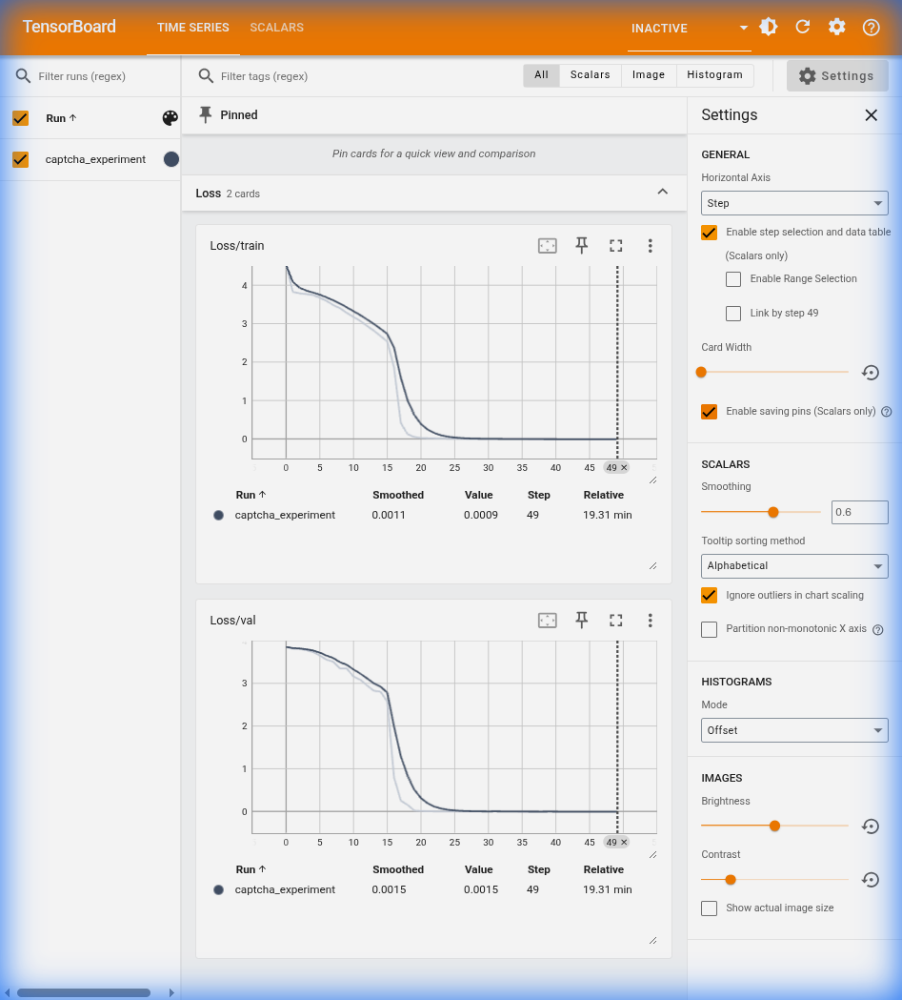

# Captcha Decoding Model

This directory contains the trained CRNN (CNN + GRU) model for decoding alphanumeric captchas.

## Training Performance

The model was trained for 50 epochs with CTC Loss. The following chart shows the training and validation loss convergence:

### Key Metrics:
- **Final Validation Loss**: 0.0013 (Epoch 49)
- **Final Training Loss**: 0.0009
- **Accuracy**: Stabilized at near 100% on the validation split.

## Files
- `captcha_model.pth`: Original float32 model (~21MB).
- `captcha_model_int8.pth`: Quantized int8 model (~11MB).
- `tensorboard_charts.png`: Visualization of the loss curves.

## Architecture
The architecture consists of a custom CNN for feature extraction followed by a bidirectional GRU for sequence modeling. CTC loss is utilized to handle OCR without requiring character-level bounding boxes.
