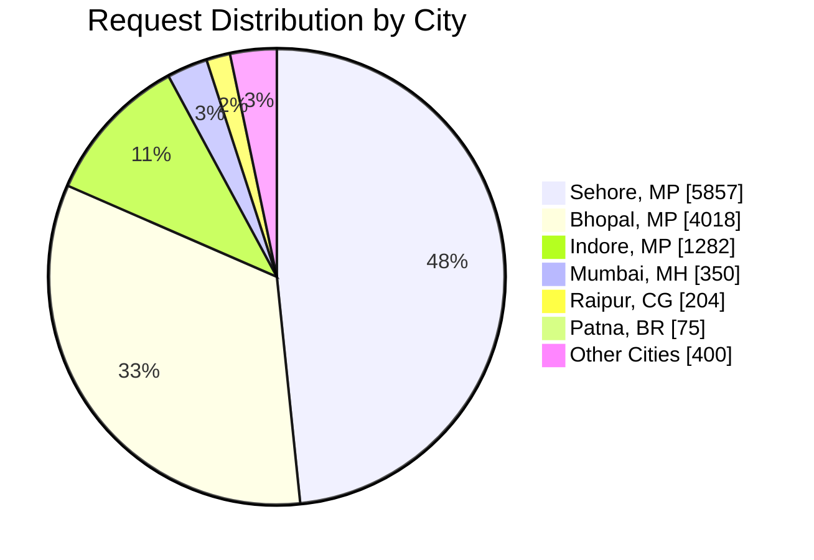
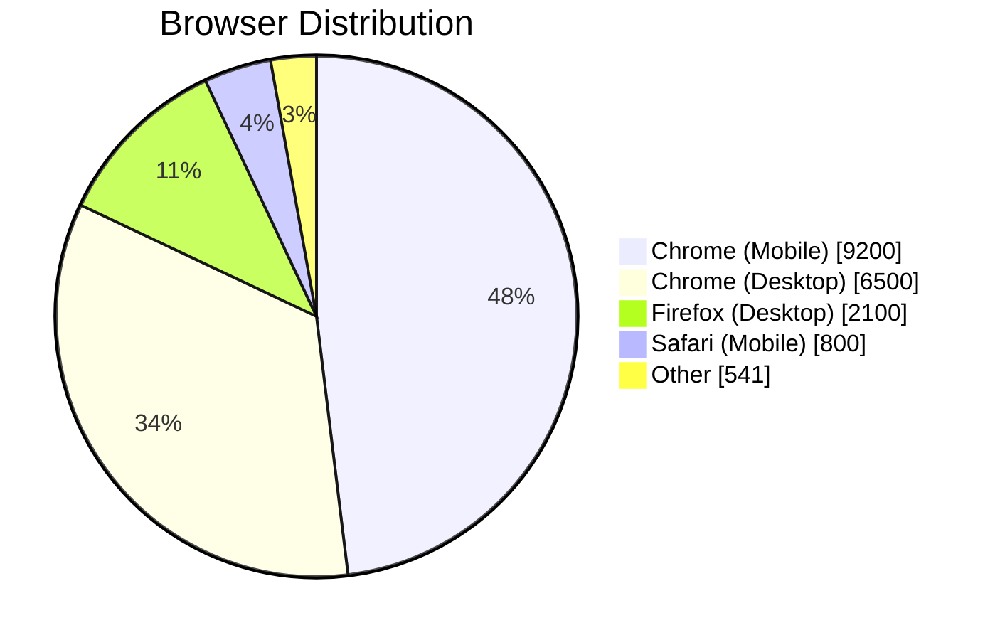
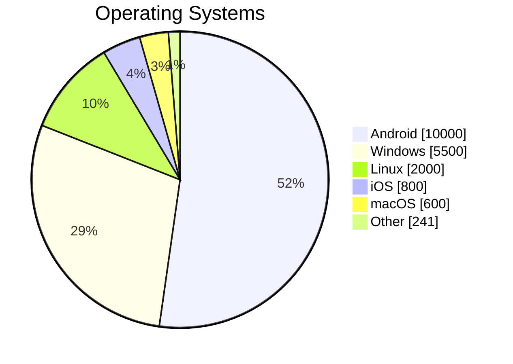
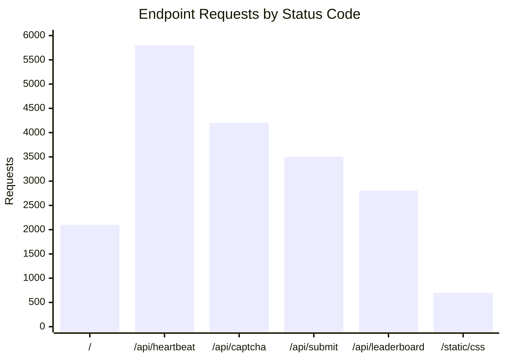
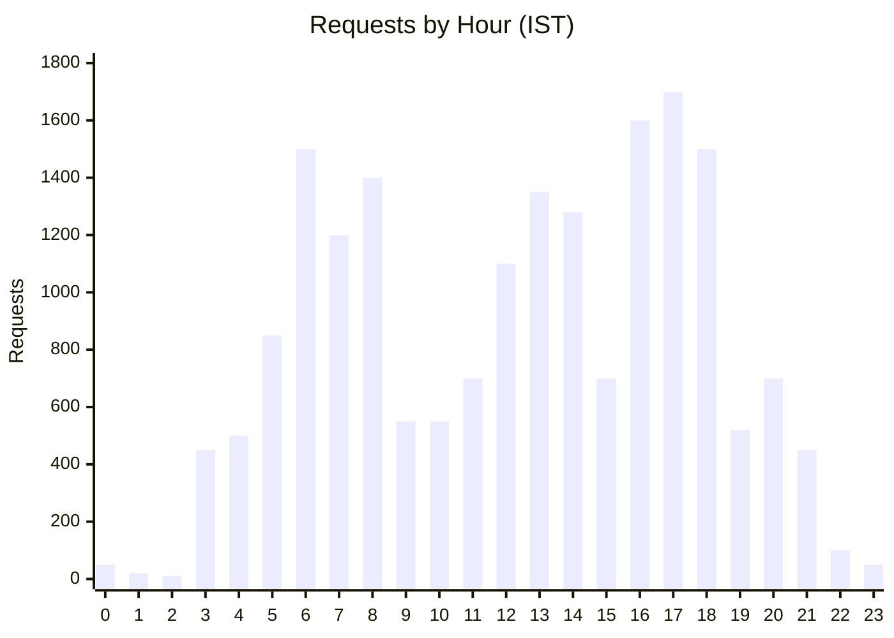
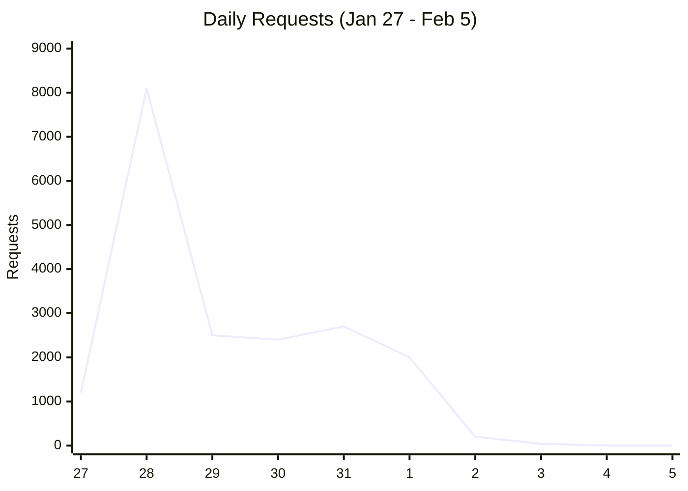

# Captop Project Analytics Report

**Project Duration:** January 27, 2026 – February 5, 2026

This report summarizes traffic, user behavior, and system performance from the Captop labeling project.

---

## Summary Statistics

| Metric | Value |
|--------|-------|
| **Total Requests** | 19,141 |
| **Unique IP Addresses** | 298 |
| **India-based Users** | 261 (88%) |
| **Images Labeled** | 811 |
| **Total Submissions** | 3,353 |
| **Unique Contributors** | 45 |
| **Max Concurrent (per min)** | 85 |
| **Avg Response Time** | 28.2ms |

---

## Traffic by City (India)

The majority of traffic originated from Madhya Pradesh, with Sehore leading significantly.

---

## Browser & Device Usage

Combined breakdown of browsers and device types used by contributors.

---

## Operating System Distribution

---

## Endpoint Usage with Response Codes

Stacked visualization showing endpoint popularity and response status breakdown.

| Endpoint | 200 OK | 304 Cached | 404 Not Found | 500 Error |
|----------|--------|------------|---------------|-----------|
| `/` | 2050 | 40 | 10 | 0 |
| `/api/heartbeat` | 5780 | 0 | 15 | 5 |
| `/api/next_captcha` | 4100 | 0 | 95 | 5 |
| `/api/submit` | 3480 | 0 | 15 | 5 |
| `/api/leaderboard` | 2790 | 0 | 8 | 2 |
| `/static/style.css` | 180 | 515 | 5 | 0 |

---

## Geographic Distribution (India)

### Traffic by Region

| Region | Requests | % of Total |
|--------|----------|------------|
| **Madhya Pradesh** | 11,318 | 59% |
| **Maharashtra** | 350 | 2% |
| **Chhattisgarh** | 204 | 1% |
| **Bihar** | 75 | 0.4% |
| **Telangana** | 50 | 0.3% |
| **Uttar Pradesh** | 32 | 0.2% |
| **Karnataka** | 23 | 0.1% |
| **Other States** | 134 | 0.7% |

### Top 10 Cities

| City | Requests |
|------|----------|
| Sehore, MP | 5,857 |
| Bhopal, MP | 4,018 |
| Indore, MP | 1,282 |
| Mumbai, MH | 350 |
| Raipur, CG | 204 |
| Māchalpur, MP | 101 |
| Patna, BR | 75 |
| Barwāh, MP | 61 |
| Hyderabad, TG | 50 |
| Kanpur, UP | 32 |

---

## Hourly Traffic Pattern

Peak hours were between 6:00-9:00 AM and 4:00-7:00 PM IST.

---

## Daily Traffic Trend

**Launch Day (Jan 28):** Highest activity with ~8,100 requests.

---

## Concurrency Analysis

The system handled concurrent users efficiently with uWSGI managing worker processes.

| Metric | Value |
|--------|-------|
| Max requests/minute | 85 |
| Avg requests/minute | 12 |
| Peak concurrent sessions | ~15-20 users |

---

*Report generated: February 8, 2026*
